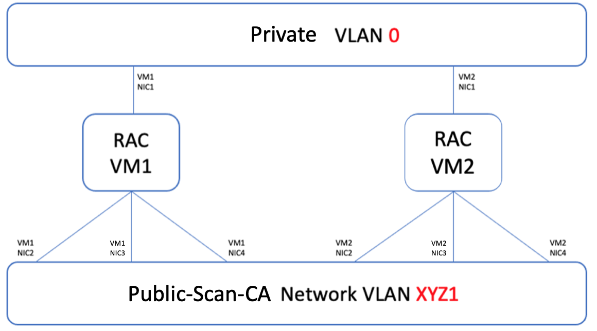
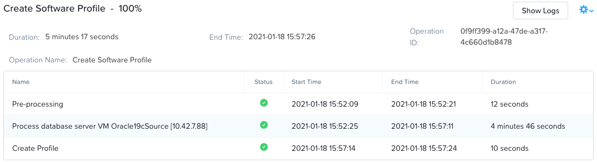

.. _deploy_oracle_rac_era:

--------------------------------------------------
Deploying Oracle RAC with Era
--------------------------------------------------

Oracle RAC is multi node clustered Oracle Instance implementation. Depending on the requirements there are as many instances (each in one Oracle VM) connecting to same disks where Oracle stores data. These disks are shared amongst all RAC hosts.

The estimated time to complete this lab is 1 hour. Oracle RAC deployment using Era takes about 1 hour for creating VMs, attaching disks and configuring the Oracle RAC Gridware software.

Create Oracle RAC Cluster with Era
++++++++++++++++++++++++++++++++++++

In this exercise you will deploy a fresh Oracle RAC server with 2 nodes.

Before we can create this Oracle RAC cluster, we need the building blocks of the Oracle RAC server.

Each of the Oracle RAC cluster building block is implemented using Era Profiles as follows:

.. list-table::
  :widths: 25 25
  :header-rows: 1

  * - Oracle RAC Component
    - Nutanix Era Building Block
  * - Network Connectivity
    - Network Profile
  * - Oracle Servers/VM/Nodes
    - Database Server Profile
  * - Oracle Software
    - Software Profile
  * - Oracle Database Parameters
    - Database Parameters Profile

We will now quickly create all these building blocks as Era Profiles.

Create Era Network Profiles for Oracle RAC
^^^^^^^^^^^^^^^^^^^^^^^^^^^^^^^^^^^^^^^^^^^

Oracle RAC Cluster has the following Networking interfaces in at least two different managed VLANs. These VLANs need to be able to provide IPs for the clients requesting it.

- Private Service
- Client Access
- Public Service
- Scan Service

The Private Service connections cannot be in the same VLAN as the others.

Each HPOC cluster is pre-configured with 2 VLANs which can be used for VMs: This is sufficient for our Oracle RAC implementation. Larger productions environments may have different VLANs for each of the component's connectivity.

.. list-table::
  :widths: 25 25 25 10 30
  :header-rows: 1

  * - Network Name
    - Network Address
    - Subnet Mask
    - VLAN
    - DHCP Scope
  * - Primary
    - 10.42.\ *XYZ*\ .1/25
    - 255.255.255.128
    - 0
    - 10.42.\ *XYZ*\ .50-10.42.\ *XYZ*\ .124
  * - Secondary
    - 10.42.\ *XYZ*\ .129/25
    - 255.255.255.128
    - *XYZ1*
    - 10.42.\ *XYZ*\ .132-10.42.\ *XYZ*\ .253

In our lab we will only create and assign two VLANs inside Era and the DHCP distribution to be managed by Era.

.. note::

  We are assuming that the following IPs are available for use. If you are unsure please use a IP scanner `tool <https://angryip.org/download/>`_ to choose 2 blocks of 5 IP addresses. This will be enough for our Oracle RAC 2 node cluster.

**RAC Network Design Visualisation**

**RAC IP Requirements**

We will need the following number of IPs for a two node Oracle RAC Clusters

.. list-table::
  :widths: 10 10 10 10
  :header-rows: 1

  * - Network Name
    - No. of RAC Nodes
    - No. of IPs per Node
    - IPs required
  * - Private
    - 2
    - 1
    - 2
  * - Public + Scan + CA
    - 2
    - 3
    - 6
  * - Totals
    -
    -
    - 8

Based on these design requirements we will create networks in Prism Central and then configure DHCP pool in Era. We will configure a larger block to make sure it will suffice a future deployment for testing.

.. list-table::
  :widths: 25 20 20 10 30 15
  :header-rows: 1

  * - Network Name
    - Network Address
    - Subnet Mask
    - VLAN
    - DHCP Scope
    - No. of IPs
  * - XYZ-RAC-Private
    - 10.42.\ *XYZ*\ .1/25
    - 255.255.255.128
    - 0
    - 10.42.\ *XYZ*\ .101-10.42.\ *XYZ*\ .105
    - 5
  * - XYZ-RAC-Public-Scan-CA
    - 10.42.\ *XYZ*\ .129/25
    - 255.255.255.128
    - *XYZ1*
    - 10.42.\ *XYZ*\ .141-10.42.\ *XYZ*\ .160
    - 20

**Create Networks in Prism Element**

#. In Prism Element, click **Settings > Network Configuration**

#. Click on **+ Create Network**

#. Enter **XYZ-RAC-Private** as Network Name and **0** as VLAN ID

#. Click on **Save**

#. Click on **+ Create Network**

#. Enter **XYZ-RAC-Public-Scan-CA** as Network Name and **XYZ1** as VLAN ID (for example: 71 is the VLAN ID)

#. Click on **Save**

**Create Networks in Era**

Now we will create corresponding networks in Era and assign DHCP pool. This would be the equivalent of the network administration providing IP blocks to be exclusively used for Oracle RAC servers.

#. Switch your browser to Era

#. In Era Menu, select **Administration**

#. Click on **Networks > Add**

#. Choose **XYZ-RAC-Private**

#. Select **Manage IP Address Pool**

#. Enter **Gateway, Subnet Mask, Primary DNS, First Address** and **Last Address** as shown below. Refer the above table for values.

   .. figure:: images/rac2.png

#. Click on **Add**

Now let's create the XYZ-RAC-Public-Scan-CA network in Era

#. Click on **Networks > Add**

#. Choose **XYZ-RAC-Public-SCAN-CA**

#. Select **Manage IP Address Pool**

#. Enter **Gateway, Subnet Mask, Primary DNS, First Address** and **Last Address** as shown below. Refer the above table for values.

   .. figure:: images/rac3.png

#. Click on **Add**

**Create Oracle RAC Network Profile**

#. In Era Menu, select **Profiles > Network**

#. Click on **+ Create > Oracle > RAC Database**

#. Fill out the following fields to configure network profile to use for Oracle RAC provisioning

   - **Name** - XYZ_ORACLE_RAC_NETWORK_PROFILE
   - **Description** - Default Oracle RAC Network Profile
   - **Nutanix Cluster** - EraCluster
   - **Public Service vLAN** - XYZ-RAC-Public-SCAN-CA
   - **Virtual Service vLAN** - XYZ-RAC-Public-SCAN-CA
   - **Scan Service vLAN** - XYZ-RAC-Public-SCAN-CA
   - **Private Service vLAN** - XYZ-RAC-Private

   .. figure:: images/rac4.png

#. Click on **Create**

Create Oracle RAC Software Profile
++++++++++++++++++++++++++++++++++++

In this section we will create Era software profile which we will use to deploy Oracle RAC database servers.

#. In Era Menu, select **Profiles**

#. Click on **Software > Add**

#. Click on **+ Create > Oracle > RAC Database**

#. Fill out the following fields to configure software profile to use for Oracle RAC provisioning

   - **Profile Name** - XYZ_ORACLE_RAC_SOFTWARE_PROFILE
     - **Description** - Default Oracle RAC Software Profile
   - **Software Profile Version Name** - Automatically created by Era
   - **Nutanix Cluster** - EraCluster
   - Choose the Oracle Single Instance source profile previously created - Oracle19cSource

   .. figure:: images/rac5.png

#. Click **Next**

#. Click on **Create**

The new profile will take at least 5 minutes to get created. You can monitor progress in the **Era > Menu > Operations** page

Create Oracle RAC Compute Profile
++++++++++++++++++++++++++++++++++++

In this section we will create Era compute profile which we will use to deploy Oracle RAC database servers.

#. In Era Menu, select **Profiles**

#. Click on **Compute > Add**

#. Click on **+ Create**

#. Fill out the following fields to compute profile to use for Oracle RAC provisioning

   - **Name** - XYZ_ORACLE_RAC_COMPUTE
   - **Description** - XYZ Compute profile
   - **vCPUs** - 8
   - **Cores per CPU** - 1
   - **Memory (GiB)** - 16

   .. figure:: images/rac7.png

Create Oracle RAC Compute Profile
++++++++++++++++++++++++++++++++++++

In this section we will create Era database profile which we will use to deploy Oracle RAC database servers. This would

#. In Era Menu, select **Profiles**

#. Click on **Database Parameters > Add**

#. Select **Oracle**

#. Fill out the following fields to compute profile to use for Oracle RAC provisioning

   - **Name** - XYZ_RAC_DB_PROFILE
   - **Description** - XYZ RAC Default Profile

#. Leave all the options as it is. You are able to fill your own desired values. However, for this exercise we will not modify values.

   .. figure:: images/rac8.png

#. Click on **+ Create**

Create Oracle RAC Cluster with Era
++++++++++++++++++++++++++++++++++++

Now that we have all the building blocks (profiles) necessary for creating a Oracle RAC database using Era, we will deploy a Oracle RAC database using your *Initials*\ **_ORACLE_19C** 1.0 Software Profile.

#. Select **Databases** from the dropdown menu and **Sources** from the lefthand menu.

#. Click **+ Provision > RAC Database**.

#. Select **Create New Cluster**

#. In the **Provision a Oracle RAC Database** wizard, fill out the following fields to configure the Oracle RAC database:

   - **Server Cluster Name** - XYZRAC
   - **Description** - (Optional)
   - **Nutanix Cluster** - EraCluster
   - **Network Profile** - XYZ_ORACLE_RAC_NETWORK_PROFILE
   - **Database Server VM Name Prefix** - XYZRAC
   - **Software Profile** - XYZ_ORACLE_RAC_SOFTWARE_PROFILE
   - **Compute Profile** - XYZ_ORACLE_RAC_COMPUTE
   - **SYS ASM Password** - Nutanix#4u
   - **ASM Driver** - None
   - **SSH Public Key for Node Access** - Select **Text** and paste the following public key

   ::

      ssh-rsa AAAAB3NzaC1yc2EAAAABJQAAAQEAii7qFDhVadLx5lULAG/ooCUTA/ATSmXbArs+GdHxbUWd/bNGZCXnaQ2L1mSVVGDxfTbSaTJ3En3tVlMtD2RjZPdhqWESCaoj2kXLYSiNDS9qz3SK6h822je/f9O9CzCTrw2XGhnDVwmNraUvO5wmQObCDthTXc72PcBOd6oa4ENsnuY9HtiETg29TZXgCYPFXipLBHSZYkBmGgccAeY9dq5ywiywBJLuoSovXkkRJk3cd7GyhCRIwYzqfdgSmiAMYgJLrz/UuLxatPqXts2D8v1xqR9EPNZNzgd4QHK4of1lqsNRuz2SxkwqLcXSw0mGcAL8mIwVpzhPzwmENC5Orw==

   .. figure:: images/rac9.png

#. Click **Next**

#. In the **RAC Topology** wizard, fill out the following field

   - **SCAN Name** - XYZRACSCAN

#. Click on **Next**

#. In the **Database** wizard, fill out the following fields

   - **Database Name** - XYZRACDB1
   - **Description** - (Optional)
   - **SID** - DB1SID
   - **Global Database Name** - RACDB1NTNX
   - **SYS and SYSTEM Password**  - (Your desired password)
   - **Size (GiB)** - 1000
   - **Fast Recovery Area Size (GiB)** - 200
   - **Database Parameter Profile** - XYZ_RAC_DB_PROFILE
   - **Character Set** - AL32UTF
   - **National Character Set** - AL16UTF16
   - **Encryption** - (Leave unchecked)
   - **Pre-Post Commands** - (Leave blank)

   .. figure:: images/rac10.png

#. Click on **Next**

#. In the **Time Machine** wizard, fill out the following fields

   - **Name** - XYZRACDB1_TM
   - **Description** - (Optional)
   - **SLA** - DEFAULT_OOB_BRONZE_SLA (do not select BRASS SLA)

#. Click on **Provision**

#. Go to **Menu > Operations** to monitor the provisioning

   .. note::

   	The provisioning might take up to an hour.

   .. figure:: images/rac11.png

We have succesfully deployed Oracle RAC database and VMs using simple to use Era software. Without Era, this process would have take many more hours or days.
